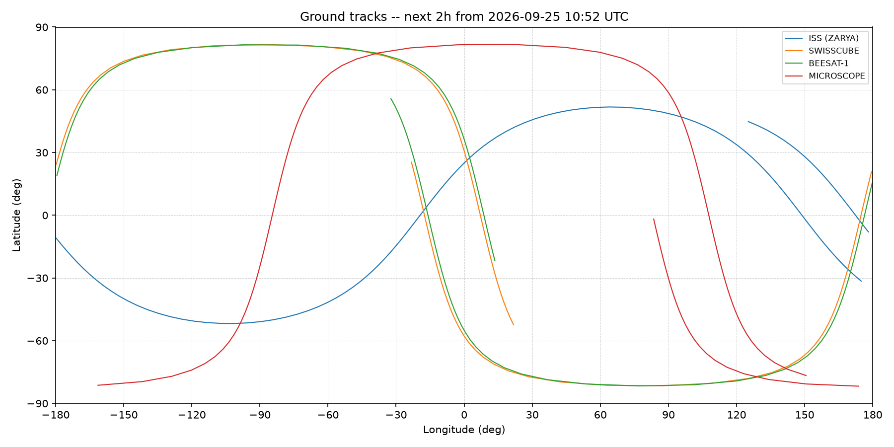

# Satellite Pass Predictor

A Python tool that predicts when satellites are visible from a ground station at
Kourou, French Guiana — the Guiana Space Centre (CSG), Europe's spaceport. It
fetches current orbital data (TLEs) from Celestrak, propagates each satellite's
trajectory with SGP4, plots ground tracks, and computes visibility windows
(elevation, azimuth, pass duration) against a configurable elevation threshold.



## Why Kourou

The Guiana Space Centre is ESA's, CNES's and Arianespace's launch site — its near-
equatorial latitude (5.2°N) gives launches a free eastward boost from Earth's
rotation, which is why Europe launches there rather than from the continent. Three
of the four satellites this tool tracks (see below) either launched from Kourou or
are CNES missions, so the project is built specifically around that ground station
rather than an arbitrary one.

This is also a portfolio project: it was built during an M.Sc. in Smart Aerospace
and Autonomous Systems, with a long-term interest in ESA-adjacent work near
Kourou, and was scoped and built to be something its author can explain and defend
in detail — the orbital mechanics and the code — not just a working repo.

## Features

- **TLE loading with caching** — fetches current orbital elements from Celestrak,
  caches them locally, and only refetches once the cache is more than a day old
  (SGP4 accuracy degrades over days as unmodeled drag accumulates). Falls back
  to a cached copy with a warning if Celestrak is briefly unreachable, and
  raises a clear, specific error rather than a raw traceback or a silent
  `IndexError` if a satellite is no longer tracked or a fetch fails outright.
- **Ground track visualization** — plots every tracked satellite's ground track
  on a lat/lon grid, correctly handling the ±180° antimeridian crossing (a naive
  plot draws a spurious line straight across the map at that point; this one
  breaks the line there instead).
- **Kourou visibility pass detection** — elevation/azimuth/range from Kourou
  over a configurable time window, with real edge cases handled deliberately
  rather than glossed over: a pass already in progress at the start of the
  window, one still in progress (and still climbing) at the end, and a pass
  that only grazes the elevation threshold for a sample or two are all reported
  with explicit flags, not silently merged into the "normal" case or dropped.
- **Combined HTML report** — the ground-track plot and the pass table combined
  into one self-contained HTML file (the image embedded as base64, not linked),
  so it can be opened or shared as a single file with nothing that can go
  missing.

## Tech stack, and why

- **SGP4** (via [python-sgp4](https://pypi.org/project/sgp4/)) — the propagation
  model, and deliberately the *only* one used here. TLEs encode SGP4-specific
  mean orbital elements, not raw physical state vectors; feeding them into a
  higher-fidelity numerical propagator (the kind tools like Orekit or GMAT use)
  as if they were osculating elements doesn't add accuracy, it introduces a
  systematic error SGP4's own perturbation model is specifically designed to
  cancel out. Pairing TLE data with SGP4 is the correct choice here, not a
  simplification.
- **[Skyfield](https://rhodesmill.org/skyfield/)** — wraps python-sgp4 and
  handles the parts that are easy to get subtly wrong by hand: time scales and
  leap seconds, the WGS84 ellipsoid, and the geocentric/topocentric frame
  transforms needed to go from "where is the satellite" to "where do I point
  a ground antenna to see it."
- **Matplotlib**, plain — ground track plotting with a simple lat/lon grid,
  deliberately without coastlines (which would mean adding cartopy). Cartopy
  can be a real dependency-installation headache on Windows, and a plain grid
  with axis labels and a legend is a perfectly good first version; not worth
  fighting install friction for polish that isn't essential to what the tool
  does.
- **[Celestrak](https://celestrak.org/)** — the TLE data source; the standard,
  free, public source for current orbital element data.
- **pytest / mypy** — the dev-only toolchain (`requirements-dev.txt`), covered
  below.

### Why these four satellites

- **ISS (ZARYA)** — large, ~400 km orbit, extremely well tracked. Used as the
  primary sanity check: its predicted position was cross-checked against
  [N2YO](https://www.n2yo.com/) at a fixed timestamp during development (see
  Verification below).
- **SwissCube** and **BEESAT-1** — two 1U CubeSats launched on the *same* 2009
  rideshare into similar orbits. Tracking both gives a natural pair for
  comparing how ~17 years of atmospheric drag has made their orbits diverge,
  even though SGP4 itself doesn't model drag beyond the TLE's own B* term.
- **MICROSCOPE** — a CNES microsatellite launched from Kourou (Soyuz VS14,
  2016) that tested Einstein's Weak Equivalence Principle to ~10⁻¹⁵ precision,
  the most precise test of it ever flown. Ties the satellite selection directly
  back to the Kourou/ESA theme. (A CNES CubeSat launched from Kourou, EyeSat,
  was the original pick here for a closer size match to SwissCube/BEESAT-1, but
  it decayed in November 2023 and Celestrak no longer has current elements for
  it — confirmed directly against Celestrak before swapping it out.)

## Project structure

```
main.py                          thin orchestrator -- calls into the package
                                  below in sequence, holds no logic of its own
satellite_pass_predictor/
├── config.py                    satellites tracked, Celestrak endpoint, TLE
│                                 caching policy, Kourou's coordinates, and
│                                 the constants that tune pass detection
├── tle_data.py                  fetches and caches TLE data from Celestrak
├── propagation.py               SGP4 propagation: subpoints and ground tracks
├── time_utils.py                shared time-grid builder used by both
│                                 propagation and visibility
├── visibility.py                topocentric elevation/azimuth and the
│                                 pass-detection state machine
├── visualization.py             ground-track plot (PNG) and the pass table
└── reporting.py                 combines both into one HTML report
tests/                           pytest suite (see Verification below), plus
                                  a fixtures/ directory holding a frozen TLE
                                  so tests never depend on a live Celestrak
                                  fetch or on the data staying "fresh"
```

## How to run it

Requires Python 3.11+.

```bash
python -m venv venv
venv\Scripts\activate        # Windows; use `source venv/bin/activate` on macOS/Linux
pip install -r requirements.txt
python main.py
```

This prints each satellite's current position, saves a ground-track plot to
`output/ground_tracks.png`, prints the Kourou visibility-pass table, and saves
the combined report to `output/report.html`.

### Running the tests

```bash
pip install -r requirements-dev.txt
pytest
mypy main.py satellite_pass_predictor/ tests/
```

## Verification

Every propagation result was sanity-checked against an independent source
before being trusted, not just assumed correct because nothing raised an
exception. ISS's predicted position was compared against
[N2YO](https://www.n2yo.com/) at a fixed, shared timestamp during development:
the two agreed to within about 7 km on the ground and to the meter in
altitude — well inside the expected agreement between two independent SGP4
implementations for a TLE less than a day old.

The test suite (29 tests as of this writing) is built around the real edge
cases found while building this, not just happy-path input: a visibility pass
already above the elevation threshold when the time window starts, one still
climbing when the window ends, a pass that only grazes the threshold for a
single sample, the antimeridian-crossing plot logic, and the TLE-fetch
fallback/error-handling paths (network failures, a satellite Celestrak no
longer tracks, a malformed response) — each reproduced as a permanent
regression test rather than left as a one-off manual check.

## Status

**Built:** TLE ingestion with caching and fallback handling, SGP4 propagation,
ground-track visualization, Kourou pass detection with edge-case handling,
a combined HTML report, full type hints (mypy-clean), and a pytest suite
covering the logic and the edge cases above.

**Planned:** a Streamlit web app on top of this for interactively exploring
ground tracks and passes, rather than only running it from the command line.
Not started yet.
